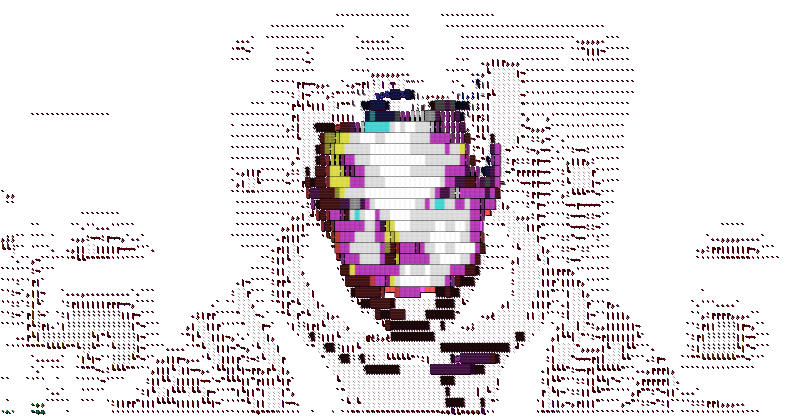

```fortran
 ::::::::  :::::::::: :::        :::::::::: ::::    ::: :::    :::  :::::::: 
:+:    :+: :+:        :+:        :+:        :+:+:   :+: :+:    :+: :+:    :+: 
+:+        +:+        +:+        +:+        :+:+:+  +:+ +:+    +:+ +:+        
+#++:++#++ +#++:++#   +#+        +#++:++#   +#+ +:+ +#+ +#+    +:+ +#++:++#++ 
       +#+ +#+        +#+        +#+        +#+  +#+#+# +#+    +#+        +#+ 
#+#    #+# #+#        #+#        #+#        #+#   #+#+# #+#    #+# #+#    #+# 
 ########  ########## ########## ########## ###    ####  ########   ########    32          
```
<div style="background-color: transparent;">
	
</div>
